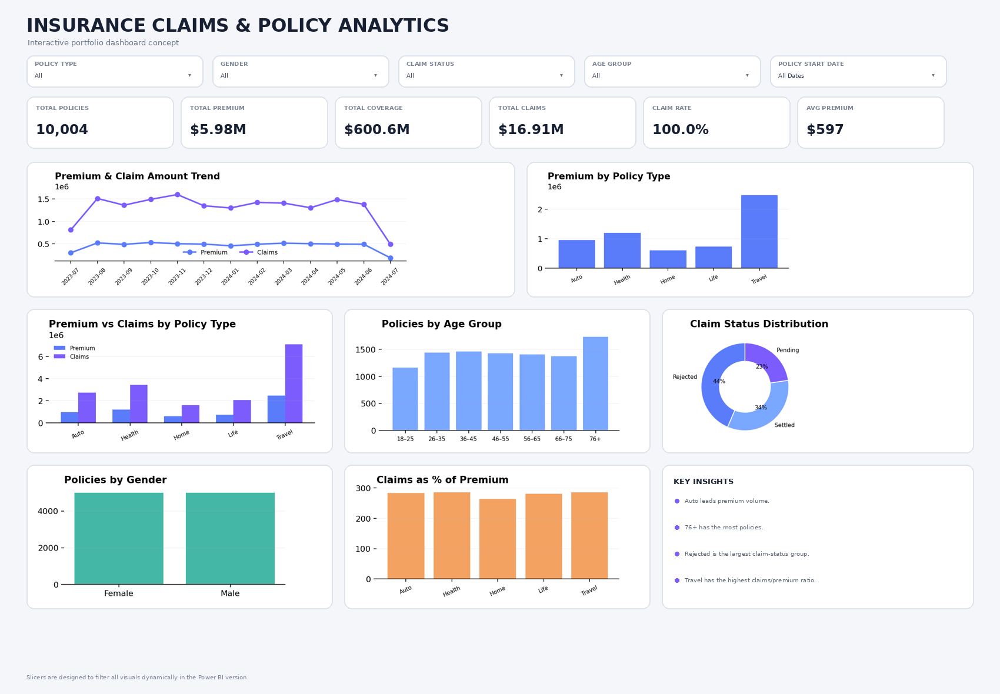

# 📊 Insurance Claims & Policy Analytics

An interactive Power BI dashboard designed to analyze insurance policies, premiums, coverage, claims, customer demographics, and claim status.

## 🎯 Business Problem

Insurance companies need to understand their policy portfolio and claim activity to monitor financial exposure and identify important patterns across customers and policy types.

This project analyzes:

- Policy volume
- Premium revenue
- Coverage amount
- Claim amount
- Claim rate
- Policy type performance
- Customer age distribution
- Gender distribution
- Claim status
- Claims-to-premium ratio

## 🛠️ Tools & Technologies

- Power BI
- DAX
- Power Query
- Excel / CSV
- Data Visualization
- Business Analysis

## 📸 Dashboard Preview

## 📌 Key KPIs

| KPI | Description |
|---|---|
| Total Policies | Number of insurance policies |
| Total Premium | Total premium amount |
| Total Coverage | Total coverage amount |
| Total Claims | Total claim amount |
| Claim Rate | Share of policies with claims |
| Average Premium | Average premium per policy |

## 📊 Dashboard Features

### Interactive Filters

- Policy Type
- Gender
- Claim Status
- Age Group
- Policy Start Date

### Visual Analysis

- Premium & Claim Amount Trend
- Premium by Policy Type
- Premium vs Claims by Policy Type
- Policies by Age Group
- Policies by Gender
- Claim Status Distribution
- Claims as % of Premium

## 🔎 Key Business Observations

- Compare premium volume across policy types.
- Identify age groups with the highest policy concentration.
- Analyze the distribution of claim statuses.
- Compare claims against premium across policy types.
- Use slicers to investigate how these patterns change across customer segments.

## 💡 Business Value

The dashboard provides a consolidated view of policy and claim performance and allows users to interactively explore the data.

It can support exploratory analysis around:

- Portfolio composition
- Claim activity
- Premium exposure
- Customer segmentation
- Policy-type performance

> The dashboard describes patterns in the available dataset; it does not establish causal relationships between customer characteristics and claims.

## 🧠 Skills Demonstrated

- Data Cleaning
- Data Modeling
- DAX
- Power BI Dashboard Development
- KPI Design
- Data Visualization
- Exploratory Data Analysis
- Business Insight Communication

## 👨‍💻 Author

**Harsh**

Data Analyst | SQL | Power BI | Python | Excel

Portfolio:  
https://harsh12103.github.io

GitHub:  
https://github.com/harsh12103

LinkedIn:  
https://linkedin.com/in/harsh-webdev
